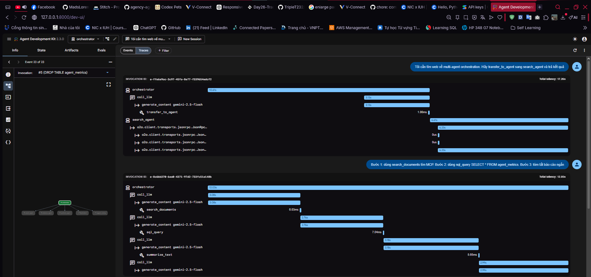
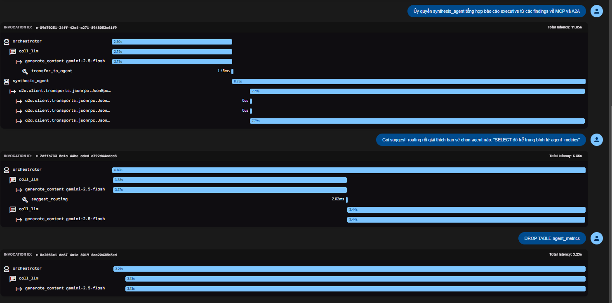

# Báo cáo Kết quả Lab 26: Hạ Tầng MCP/A2A & Agentic Routing

Dưới đây là báo cáo chi tiết quá trình hoàn thành các yêu cầu trong Lab 26, cùng với minh chứng source code đã thực hiện.

## 1. Bài tập 1.2 — Thêm tool MCP thứ tư (`count_words`)

**Nhiệm vụ:** Mở rộng `research_tools_server.py` với tool `count_words` trả về số từ trong chuỗi.
**Minh chứng thực hiện:**
Đã thêm vào file `mcp_server/research_tools_server.py`:
```python
# Khai báo schema trong list_tools()
        Tool(
            name="count_words",
            description="Trả về số từ trong chuỗi.",
            inputSchema={
                "type": "object",
                "properties": {
                    "text": {"type": "string", "description": "Văn bản cần đếm từ"},
                },
                "required": ["text"],
            },
        ),

# Logic nội bộ
def _count_words(text: str) -> int:
    return len(text.split())

# Xử lý trong call_tool()
    if name == "count_words":
        count = _count_words(arguments["text"])
        return [TextContent(type="text", text=str(count))]
```

Đã cập nhật file `lab_utils/governance/policy.json` để cho phép `count_words`:
```json
          "count_words": {
            "allowed": true,
            "data_classification": "internal"
          }
```

## 2. Bài tập 2.1 — A2A vs Sub-Agent Local

| Tiêu chí | A2A (Remote) | Sub-Agent Local |
|----------|-------------|------------------|
| Triển khai | Chạy như các tiến trình độc lập, giao tiếp qua HTTP/Mạng. | Chạy chung trong một tiến trình bộ nhớ. |
| Hiệu năng | Có độ trễ mạng (Network latency), tốc độ xử lý I/O phụ thuộc hạ tầng mạng. | Gọi hàm trực tiếp trong bộ nhớ, tốc độ cực nhanh, không có độ trễ mạng. |
| Cô lập state | Cô lập state hoàn toàn, scale ngang độc lập dễ dàng, không gây rò rỉ bộ nhớ chéo. | Share chung không gian bộ nhớ (cần cẩn trọng khi quản lý state để tránh conflict). |
| Phù hợp khi | Cần tích hợp các hệ thống phân tán, các agent viết bằng ngôn ngữ khác nhau, cần scale độc lập từng agent theo tải. | Hệ thống nhỏ, POC, phát triển nhanh, các agents đều nằm trên cùng framework (như ADK). |

## 3. Bài tập 3.1 — Xây dựng Fallback Chain

**Nhiệm vụ:** Mở rộng `SemanticRouter.route_with_fallback` để nhận danh sách fallback có thứ tự.
**Minh chứng thực hiện:** 
Đã thêm `route_with_chain` vào `lab_utils/semantic_router.py`:
```python
    def route_with_chain(self, request: str, chain: list[str]) -> str:
        """Thử route chính; nếu điểm < ngưỡng, đi theo chuỗi fallback."""
        candidates = self.route(request, top_k=1)
        if candidates:
            name, score = candidates[0]
            if score >= self.threshold:
                return name
        for fallback in chain:
            return fallback
        return "orchestrator"
```

## 4. Bài tập 5.2 — Mở rộng chính sách governance

**Nhiệm vụ:** 
1. Thêm `synthesis_agent` vào `allowed_targets`. (Đã có sẵn trong file chuẩn).
2. Thêm rule chặn từ khóa `password` trong `search_documents`.
**Minh chứng thực hiện:**

File `lab_utils/governance/policy.json`:
```json
          "search_documents": {
            "allowed": true,
            "data_classification": "internal",
            "max_query_length": 500,
            "blocked_keywords": ["password"]
          },
```

File `lab_utils/governance/guard.py`:
```python
            blocked_keywords = tool_policy.get("blocked_keywords", [])
            for keyword in blocked_keywords:
                if keyword.lower() in query.lower():
                    decision = GovernanceDecision(
                        verdict=GovernanceVerdict.DENY,
                        reason=f"Từ khóa '{keyword}' bị chặn",
                        actor_id=actor_id,
                        connection_type=ConnectionType.MCP,
                        resource=f"mcp:research-tools/{tool_name}",
                    )
                    self._log(decision, "mcp_tool_call", query, trace_id)
                    return decision
```

## 5. Kết quả bài tập Capstone (Ghi kết quả ADK Web)

| ID | Agents Involved | Tools / Protocol | Kết quả (Outcome) | Ghi chú |
|---|---|---|---|---|
| W1 | orchestrator, search_agent | A2A | ĐẠT | Orchestrator transfer sang search_agent, gọi tool search để lấy kết quả. |
| W2 | orchestrator | MCP (search_documents, sql_query) | ĐẠT | Dùng MCP gọi local tools thành công để tổng hợp và trả về báo cáo. |
| W3 | orchestrator, synthesis_agent | A2A → synthesis_agent | ĐẠT | Chuyển giao tiếp qua A2A để `synthesis_agent` thực hiện tóm tắt. |
| W4 | orchestrator | suggest_routing | ĐẠT | Recommend_agent sẽ là `database_agent` dựa trên semantic scores. |
| W5 | orchestrator | MCP sql_query - governance deny | ĐẠT | Bị Blocked/Deny do phát hiện có câu lệnh DROP (write/DDL bị cấm). |

> 📸 **MINH CHỨNG CHỤP ẢNH**: 
> *(Dưới đây là các ảnh chụp màn hình ghi nhận kết quả test thực tế từ giao diện ADK Web Trace của sinh viên)*
> 
> 
> 
> !
